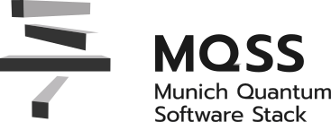

<p align="center">
  <a href="https://mqt.readthedocs.io">
    <picture>
      <source media="(prefers-color-scheme: dark)" srcset="figures/logo-mqss-dark.svg" width="60%">
      
    </picture>
  </a>
</p>

# The Munich Quantum Software Stack (MQSS)

The **Munich Quantum Software Stack (MQSS)** is a modular, community-driven software ecosystem for hybrid quantum-classical computing, developed under the Munich Quantum Valley (MQV) initiative. It aims to provide a unified, extensible, and efficient interface from high-level quantum applications down to diverse quantum hardware, tightly integrated with classical HPC environments.

---

## Vision & Mission

- Lower the entry barrier to quantum computing by providing **high-level abstractions** and tools.
- Support **heterogeneous quantum hardware** (different technologies, vendors) under a unified interface.
- Enable **tight integration with HPC systems**, treating quantum processors as accelerators in classical workloads.
- Be **modular, extensible, and community-governed**, so that new backends, frontends, or optimizations can be plugged in.

---

## Core Components & Architecture

While work is ongoing, some of the key building blocks in MQSS include:

- **QDMI** ([MQSS *Quantum Device Management Interface*](https://munich-quantum-software-stack.github.io/QDMI/)): A low-level interface defining how software tools interact with quantum devices (job submission, constraints, telemetry).
- **Programming Interfaces** ([MQSS *Adapters Suite*](https://munich-quantum-software-stack.github.io/MQSS-Interfaces/)): Bridges to frameworks like Qiskit, PennyLane, and others, allowing users to express quantum algorithms in familiar APIs.  
- **Compiler / optimization layers** ([MQSS *Passes Suite*](https://munich-quantum-software-stack.github.io/MQSS-Passes-Documentation/mlir/)): Multi-stage compilation pipelines, pass transformations, hardware-specific lowering, and optimizations.  
- **Device backends / plugins** ([MQSS *QDMI Devices Suite*](https://munich-quantum-software-stack.github.io/MQSS-QDMI-Devices-Suite/)): Modules to integrate particular quantum hardware (superconducting, ion traps, neutral atoms, etc.).
- **Benchmarking** ([MQSS *Benchmarking Framework*](https://github.com/Munich-Quantum-Software-Stack/MQSS-Benchmarking-Framework/)): An automated and reproducible framework designed to unify quantum computing benchmarks across hardware, software, simulators, algorithms, and applications.

If you would like to explore all the publicly available components, you should visit our [Component Catalog](https://munich-quantum-software-stack.github.io/Component-Catalog/)

---

## Getting Started

1. Explore the individual repositories under this organization (e.g. `QDMI`, `MQSS-Passes-Suite`, etc.), many are already public and many more are to come.
2. Read the documentation and design rationale in each repo (look for `README.md`, `docs/`, etc).  
3. To contribute: fork a repo, follow its contributing guidelines (e.g. coding style, tests, documentation).  
4. Use issues / PRs for discussion, design proposals, bug reports, and feature requests.  
5. Engage with the community: review others' contributions, propose new modules, open design discussions.

---

## Placing requests

If you want to request a new feature, ask a question, or report a bug to the MQSS team, please use the dedicated issue templates of the following components:

- [Munich Quantum Portal](https://github.com/Munich-Quantum-Software-Stack/MQP-Dashboard-Frontend/issues)
- [Benchmarking Framework](https://github.com/Munich-Quantum-Software-Stack/MQSS-Benchmarking-Framework/issues)

Each submission creates an issue in the relevant MQSS repository and ensures structured communication with the responsible developers.

### Advanced requests and contributions

In addition to the general issue-based request mechanism, MQSS offers a dedicated contact pathway for advanced users, project partners, and external developers who are interested in contributing to or extending the Munich Quantum Software Stack.

For these cases, please fill out the following template:

- [Create a request for the Benchmarking team](https://github.com/Munich-Quantum-Software-Stack/MQSS-Benchmarking-Framework/issues/new?template=contact_benchmarking.yml)
- [Create a request for the Munich Quantum Portal Dashboard team](https://github.com/Munich-Quantum-Software-Stack/MQP-Dashboard-Frontend/issues/new?template=contact_mqp_dashboard_frontend.yml)

Submissions via this template are reviewed directly by the MQSS team and lead to follow-up discussions or joint development activities.

These workflows will be expanded to include additional MQSS components.

---

## Contributing & Governance

- Contributions are welcome, whether code, documentation, tests, benchmarks, or design proposals.  
- Please follow repository-level **CONTRIBUTING.md** and **CODE_OF_CONDUCT** guidelines (if present).  
- Use issue templates and pull request templates where available.  
- Design and architecture discussions can be held in issues or dedicated "discussion" threads before coding.  
- Maintain backwards compatibility, clear API versioning, and ensure tests / CI pass before merge.

---

## License & Citation

All components in the MQSS are open-source under permissive licenses (e.g., Apache 2.0 with LLVM Exceptions).
If you use the MQSS or parts thereof in research or production, please cite the MQSS overview paper:

> Burgholzer, Echavarria, et al. [*"The Munich Quantum Software Stack: Connecting End Users, Integrating Diverse Quantum Technologies, Accelerating HPC"*](https://arxiv.org/abs/2509.02674) (2025).

```bibtex
@misc{mqss,
  title        = {{The Munich Quantum Software Stack: Connecting End Users, Integrating Diverse Quantum Technologies, Accelerating HPC}},
  shorttitle   = {{The Munich Quantum Software Stack}},
  author       = {Burgholzer, Lukas and Echavarria, Jorge and Hopf, Patrick and Stade, Yannick and Rovara, Damian and Schmid, Ludwig and Kaya, Ercüment and Mete, Burak and Farooqi, Muhammad Nufail and Chung, Minh and De Pascale, Marco and Schulz, Laura and Schulz, Martin and Wille, Robert},
  year         = 2025,
  eprint       = {2509.02674},
  eprinttype   = {arxiv},
}
```

Some repositories may contain more fine-grained license or citation files (e.g. `LICENSE`, `CITATION.cff`).

---

## Community & Contact

- Feel free to open issues or PRs in any public repo. 
- The development of this project is led by [Laura Schulz](mailto:laura.schulz@lrz.de) (LRZ), [Martin Schulz](mailto:martin.w.j.schulz@tum.de) (TUM CAPS), and [Robert Wille](mailto:robert.wille@tum.de) (TUM CDA) on the management side and [Lukas Burgholzer](mailto:lukas.burgholzer@tum.de) (TUM CDA) as well as [Jorge Echavarria](mailto:jorge.echavarria@lrz.de) (LRZ) from the technical side.
- If you want to contribute to private or in-development parts, feel free to contact the Architecture Review Board (ARB) of the MQSS using this email: [MQSS at Munich-Quantum-Valley.de](mailto:mqss@munich-quantum-valley-de).  
- Stay tuned for announcements, workshops, or developer calls via MQV / Munich Quantum Valley channels.  
- Visit [MQV's *Munich Quantum Software Stack* Official Webpage](https://www.munich-quantum-valley.de/research/research-areas/mqss).

---
